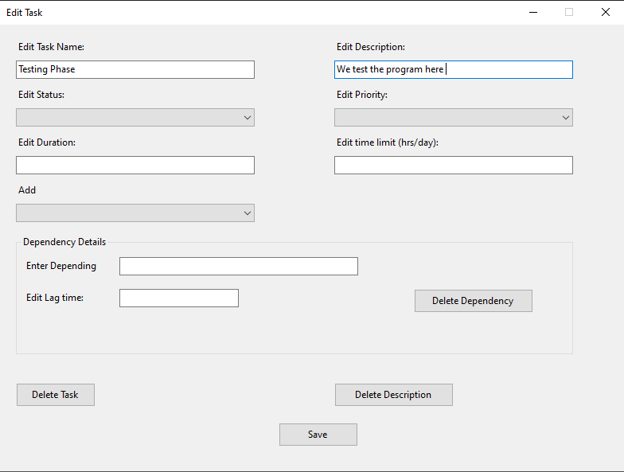
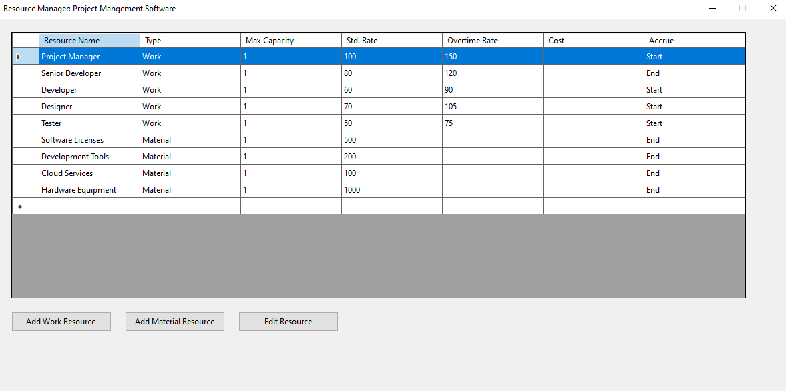

# Project-Manager-Pro

## I - Giới thiệu
### Phần mềm quản lý
Phần mềm quản lý dự án là công cụ hỗ trợ đắc lực trong việc lập kế hoạch, theo dõi và quản lý các dự án. Phần mềm cho phép người dùng tạo và quản lý các công việc, phân bổ nguồn lực, thiết lập mối quan hệ phụ thuộc giữa các task, theo dõi tiến độ và tạo biểu đồ Gantt trực quan. Với các tính năng như quản lý thời gian, nguồn lực và chi phí, phần mềm giúp các nhà quản lý dự án tối ưu hóa quy trình làm việc, nâng cao hiệu quả và đảm bảo dự án được hoàn thành đúng tiến độ.


## II - Cài đặt và sử dụng
### Cách cài đặt
#### 1. Clone Repository
``` bash
git clone https://github.com/Salierie/Project-Manager-Program.git
cd Project-Manager-Program
```
#### 2. Mở Project
- Mở Visual Studio 2022
- Chọn "Open a project or solution"
- Tìm đến thư mục vừa clone và mở file `Project-Manager-Pro.sln`

#### 3. Publish ứng dụng
- Trong Solution Explorer, click chuột phải vào project
- Chọn "Publish"
- Chọn "Folder" làm target
- Chọn đường dẫn output (ví dụ: `publish`)
- Trong Configuration:
  - Deployment Mode: Self-contained
  - Target Runtime: win-x64
  - File publish options: Produce single file
- Click "Publish"

#### 4. Chạy chương trình
- Sau khi publish xong, vào thư mục publish đã chọn
- Chạy file `Project-Manager-Pro.exe`

### Lưu ý:
- Cần cài đặt .NET 8.0 SDK
- Visual Studio 2022 (bản mới nhất)
- Đảm bảo đã restore tất cả NuGet packages trước khi build

### Hướng dẫn sử dụng cơ bản
1. Khi khởi động, bạn sẽ thấy màn hình chào mừng (Welcome Screen)

2. Tại màn hình chính:
   - Tạo dự án mới hoặc mở dự án có sẵn
   - Quản lý các task thông qua Task Screen
   - Quản lý nguồn lực trong Resource Manager
   - Xem tiến độ dự án qua Biểu đồ Gantt

3. Quản lý công việc (Task):
   - Thêm task mới
   - Phân công người thực hiện
   - Cập nhật tiến độ
   - Thiết lập mối quan hệ giữa các task

4. Quản lý nguồn lực:
   - Thêm/sửa/xóa nguồn lực
   - Phân bổ nguồn lực cho các task
   - Theo dõi khả năng sẵn có của nguồn lực

5. Theo dõi tiến độ:
   - Xem biểu đồ Gantt
   - Cập nhật tiến độ thực tế
   - Xuất báo cáo

## III - Chức năng







## Thành viên đóng góp:
I - Hồ Ngọc Bảo
II - Huỳnh Thiên Văn
III - Tô Xuân Đông
IV - Hoàng San
