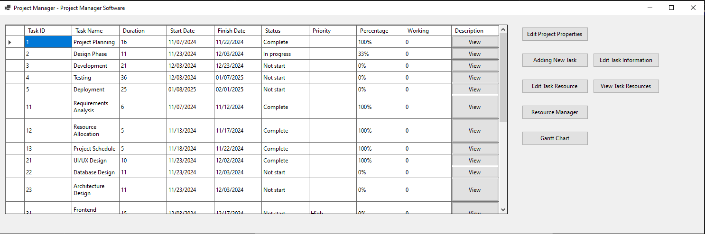
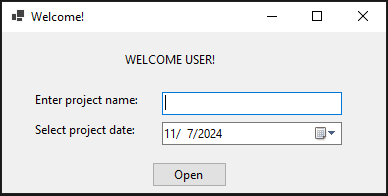
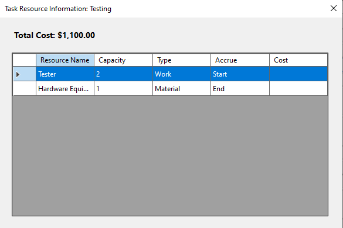
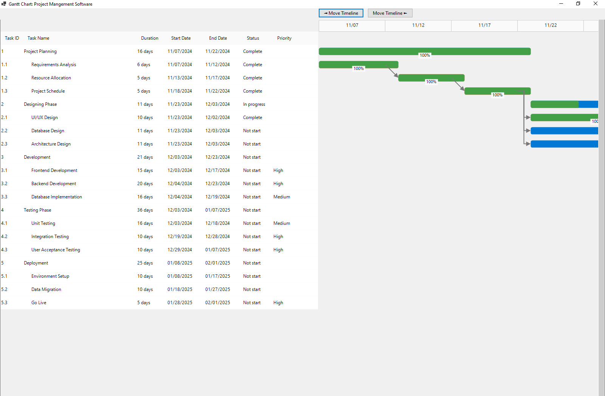

# Project-Manager-Pro

## I - Giới thiệu
### Phần mềm quản lý
Phần mềm quản lý dự án là công cụ hỗ trợ đắc lực trong việc lập kế hoạch, theo dõi và quản lý các dự án. Phần mềm cho phép người dùng tạo và quản lý các công việc, phân bổ nguồn lực, thiết lập mối quan hệ phụ thuộc giữa các task, theo dõi tiến độ và tạo biểu đồ Gantt trực quan. Với các tính năng như quản lý thời gian, nguồn lực và chi phí, phần mềm giúp các nhà quản lý dự án tối ưu hóa quy trình làm việc, nâng cao hiệu quả và đảm bảo dự án được hoàn thành đúng tiến độ.

## II - Cài đặt và sử dụng

## III - Chức năng

## Thành viên đóng góp:
- 1) Hồ Ngọc Bảo
- 2) Huỳnh Thiên Văn
- 3) Tô Xuân Đông
- 4) Hoàng Sân
